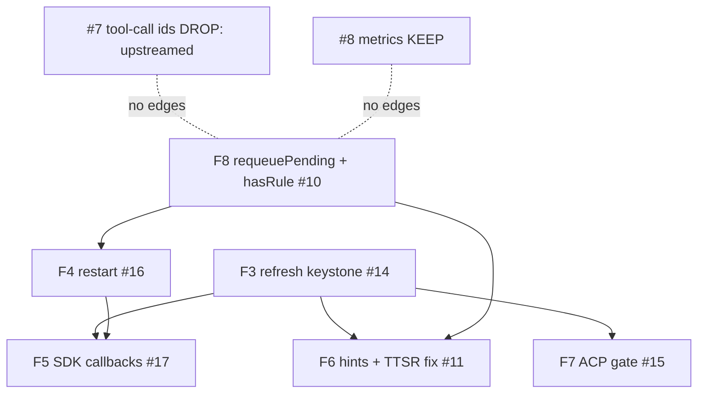

# Fork re-sync: reset to upstream v18.1.10 + reduced curated re-lay

Status: Frozen (PR #35). Reconciled 2026-09-04 after execution — see the note below.

> **Reconciliation note (2026-09-04, post-execution).** This record froze via PR
> #35 as the reset-and-re-lay contract. Between the freeze and the reset, upstream
> advanced, so the reset actually landed on **v18.1.10 (`ddde7db10a`)**, not the
> v18.1.7 (`c4da0d08e8`) named in the original body. Four consequences correct the
> frozen text; the rest of the record stands:
>
> 1. **Reset target is v18.1.10 (`ddde7db10a`).** Everywhere the body says v18.1.7
>    / `c4da0d08e8`, read v18.1.10 / `ddde7db10a`. The Task-1 force-push runbook
>    below **has already executed** — it is retained for provenance only and its
>    `sha=` has been corrected to the executed target; **do not re-run it**:
>    re-running would reset `main` back to the reset point and discard every
>    re-lay merged since.
> 2. **PR-path natives fetch ships from the UPSTREAM scope, pinned to base
>    version** (`@oh-my-pi/pi-natives-linux-x64@<base>`, base = the checkout's
>    version with any `-rigel.N` suffix stripped), not the `@rigelbuild` scope the
>    keep/drop rows below specify. Reason: `@rigelbuild/omp-natives-linux-x64` has
>    only `18.0.3` published, which lacks bindings the v18.1.10 tree calls. The
>    fetch **flips back to `@rigelbuild`** once the fork cuts its first post-reset
>    native release (`18.1.10-rigel.1`); that flip also closes the sentinel-bypass
>    gap, so a fork change to an existing export's behavior fails visibly instead
>    of testing silently against upstream semantics.
> 3. **Version scheme (OQ1 resolved by Matt): `<upstream-version>-rigel.<N>`**
>    (e.g. `18.1.10-rigel.1`, increment `N` per fork patch, reset on each upstream
>    re-sync base). This supersedes the tag-scheme text everywhere it appears —
>    the OQ1 Open-Questions entry, the "Version + tag scheme" Global Constraints
>    bullet, and Task 3's "Depends on OQ1" paragraph. OQ1 has landed: Tasks 3/7
>    are no longer gated on it, and the `--match v*` globs in `scripts/release.ts`
>    and `scripts/fix-changelogs.ts` need no change under the `-rigel.N` scheme
>    (a `18.1.10-rigel.N` tag carries no collision with an upstream `v*` tag).
> 4. **Pre-reset safety tags are pushed (OQ6 done):** `pre-resync-2026-09-03`
>    (`d9000dfd81`) and `pre-resync-record-2026-09-03` (`b62ebd73`) are both on
>    origin.

## Problem / Intent

Fork `main` (`d9000dfd81`) is 20 curated commits atop upstream `160ed439`
(v18.0.2-12); upstream `main` is 1752 commits ahead at `c4da0d08e8` = tag
**v18.1.7** (verified: `git rev-list --left-right --count origin/main...upstream/main`
= `20 / 1752`). The fork cannot take the latest model catalog (blocked on Fable
5.1) until it re-syncs. A trial merge (`git merge-tree --write-tree
--name-only origin/main upstream/main`, rc=1) produces ~10 content-conflict
files, almost all of them the RIG-2218 refresh/restart re-land surface.

## Approach

**Reset fork `main` to upstream tip `c4da0d08e8` (v18.1.7), then re-lay a
REDUCED curated patch set** (Matt's ruling, 2026-09-03). The refresh/restart
subsystem (six RIG-2218 F-patches) is dropped entirely: Matt judged it
low-value ("refresh turned out a bit useless because it doesn't change the
system prompt or model roles") and it is the bulk of the conflict surface.
What survives is the release machinery, the CI work, the Prometheus metrics
endpoint, and the fork-novel bugfix PRs, plus harness PR #34.

### Keep/drop table

| Commit | Subject (PR) | Disposition | Reasoning |
|---|---|---|---|
| `9670d742ef` | #7 fix(ai): pair composite Responses tool-call ids | **DROP: redundant** | Upstreamed verbatim as `7bf5230c0d` (in `upstream/main`, `git merge-base --is-ancestor` confirms), same 2-file diff (+438/-31), plus upstream follow-ups `243303d91d` and `3a710cd0f7` that scope the pairing further. Re-laying would regress those follow-ups. |
| `3f3c9d08f1` | #8 feat(auth-broker): Prometheus /metrics endpoint | **KEEP: re-lay (rebase until upstream #10290 lands)** | Fork-novel: `prometheus-metrics.ts` absent upstream, no `/metrics` route in `upstream/main:packages/ai/src/auth-broker/server.ts`. Cherry-pick sim onto v18.1.7 conflicts only in `eval-code-mode-declarations.test.ts` (a one-line `Map` type annotation). Auth-broker drift upstream (remote-store rework, `server.ts` +51/-43 vs fork) means the route wiring needs re-verification, not redesign. Already proposed upstream as can1357/oh-my-pi#10290 (open); when that merges the fork carry drops as redundant (OQ3, Task 5). |
| `f0fa2687bb` | #10 F8 shared infra: requeuePending + hasRule | **DROP** | Only consumers are F6 (`hasRule` at `rule-buckets.ts:64`) and F4 (`requeuePending` at `agent-session.ts:912`, blame = `d15b6072d1`). No KEEP commit references either symbol (grep over `origin/main` `packages/`: all other `hasRule` hits are an unrelated local helper in `packages/ai/test/schema-compatibility.test.ts`). |
| `74b73bccec` | #11 F6 refresh hints + TTSR re-bucket fix | **DROP** (incl. the TTSR fix; see OQ2) | Refresh hints reference the refresh tool by name (`rule-protocol.ts`, `skill-protocol.ts` error text). The TTSR re-bucket fix gates on F8's `hasRule` and only changes behavior on an in-session re-bucket; the sole re-bucket caller (`extensibility/reload.ts:124`) is introduced by F3. At init the old `addRule`-return gating is equivalent, so without refresh the fix is dead weight. |
| `2425f98875` | #14 F3 refresh tool keystone | **DROP** | The subsystem root (20 files, +1999): `extensibility/reload.ts`, refresh tool, slash command, `agent-session.ts` +284. Matt-ruled out. |
| `886e4dd441` | #15 F7 ACP permission gate for refresh | **DROP** | Gates the F3 refresh tool; meaningless without it (`acp-permission-gate.ts` +24 references refresh). |
| `d15b6072d1` | #16 F4 in-session restart tool | **DROP** | Calls F8's `requeuePending` in `#wakeForIrc` (`agent-session.ts:911-914`); restart tool + 866-line test are the subsystem. |
| `77d4d1d5c4` | #17 F5 SDK lifecycle callbacks | **DROP** | Imports `RefreshScope` from `./extensibility/reload` (F3) and binds `requestRestart` (F4): `git show 77d4d1d5c4 -- packages/coding-agent/src/sdk.ts`. Depends on the whole drop set. |
| `83e08681fb` | #20 feat(release): @rigelbuild scope publish | **KEEP: re-lay** | Fork's only npm publish path. `scripts/rigel-scope-rename.ts` absent upstream. Cherry-pick sim onto v18.1.7: CLEAN. |
| `d208a2e9ba` | #22 fix(release): tagless first release | **KEEP: re-lay** | Cherry-pick sim: CLEAN. Load-bearing post-reset: the fork's only tag `v18.0.3` points at `fdedd3c7f8`, which will NOT be an ancestor of the new main, so `git describe --tags` hits the tagless path again on the first post-reset release. |
| `5287792c92` | #23 refactor(release): drop sd shell-out | **KEEP: rework** | Cherry-pick sim conflicts in `release.ts` + `release.test.ts`: upstream still shells to `sd` (`upstream/main:scripts/release.ts:296,315,352`) but added canary versioning (`14f798c1e0`) and centralized version comparison in pi-utils, so the in-process rewrite must be re-expressed against the moved script, not cherry-picked. |
| `91737b1b3d` | #24 fix(release): changelog diff floor | **KEEP: re-lay** | Cherry-pick sim: CLEAN. Same tagless-fork rationale as #22 (`resolveSince`/`changelogDiff` still present at `upstream/main:scripts/fix-changelogs.ts:826,914`). |
| `1726adb5c5` | #27 fix(release): CI-poll transient retry | **KEEP: rework (minor)** | `watchCI` still a bare poll upstream (`scripts/release.ts:46`; no `isTransientGhError`/`runWithTransientRetry` upstream). Sim conflicts only in `release.test.ts`. |
| `550fc4ba40` | #28 ci: hosted runners | **KEEP: rework** | Upstream `ci.yml` still selects `omp-kata` for all non-PR jobs (`upstream/main:.github/workflows/ci.yml:148,176,222,...`); that runner scale set exists only in can1357's org, so a reset fork without this patch has main/release jobs queueing forever. Sim conflicts in `ci.yml` (moved 1752 commits): re-express the collapse-to-`ubuntu-22.04`, do not cherry-pick. |
| `269e109c9c` | #29 test(pi-shell): ignore job-control kill test | **KEEP: re-lay (in Task 2, CI-survival)** | Sim: CLEAN. Upstream test still un-ignored (`crates/pi-shell/src/shell.rs:2809`); it never completes on a hosted runner, so the first post-reset main-event `rust_validate` (`bazelisk test //crates/...`) hangs to timeout without this `#[ignore]`. Rides in the CI PR (Task 2), not test-hygiene, because Task 2's acceptance gate depends on it. |
| `fdedd3c7f8` | #31 test(mnemopi→memory-tools): event-gate dispose test | **KEEP: re-lay** | Sim: CLEAN. Upstream `memory-tools.test.ts:836-844` still asserts wall-clock bounds (`elapsedMs < BUDGET_MS * 5`), the exact flake this fixed. |
| `d9000dfd81` | #33 ci: fork natives scope + cache split (carries #32) | **KEEP: re-lay** | Sim: CLEAN in isolation. Upstream `ci.yml:232` still fetches `@oh-my-pi/pi-natives-linux-x64@latest` (upstream's own scope; correct for them, wrong for the fork). The fork tip is a squash whose diff ALSO contains all of PR #32's content — the `linux`→`linux-rust`/`linux-natives` cache-scope split (`ci.yml @@ -178, @@ -277`) and both `Save bazel disk cache` steps with quota notes (`@@ -206, @@ -316`). So re-laying `d9000dfd81` carries #32; there is no separate #32 cherry-pick. Must follow the #28 rework in sequence, so expect contextual conflicts in the actual re-lay. |
| `f149ee0664` | PR #32 ci: linux bazel disk cache | **DROP: subsumed by #33** | #32's full content is byte-for-byte inside #33's squash `d9000dfd81` (Matt merged #32 into #33's branch, then #33 to main as one squash). Cherry-picking it after #33 would be an empty commit or a conflict — do NOT schedule it separately. |
| `71c16e53bd`, `5003010a5c` | version bumps to 18.0.3 | **DROP: superseded** | Version handling moves to the post-reset version decision (OQ1); the reset tree arrives at upstream's 18.1.7. |
| `42e5b2dc0b` | base sync anchor | **DROP: n/a** | The old base marker; replaced by the reset itself. |

### Dependency-graph summary (the separability proof)



The drop set {F3, F4, F5, F6, F7, F8} is closed: every F-symbol consumer is
another F-patch, and no KEEP commit imports from the set (grep evidence in the
table). Dropping it wholesale cannot break a kept build.

### Harness PR dispositions (post-sync)

| PR | Issue | Disposition | Evidence |
|---|---|---|---|
| #30 | RIG-3193 input_text on function_call_output | **CLOSE: redundant** | Upstream `openai-responses-server-schema.ts:84,132`: `functionCallOutputContentBlockSchema = inputTextSchema...` is accepted in `output`. Fixed by upstream `39cf639c` lineage (v18.1.4), broader than the fork diff. |
| #26 | RIG-3073 null strict/parameters/description | **REBASE + MERGE: still fork-novel** | Upstream `toolSchema` (`openai-responses-server-schema.ts:297-299`) is `"strict?": "boolean"` etc.: optional, not nullable, so a LiteLLM-forwarded `null` still rejects. Re-apply sim onto v18.1.7: conflicts only in `auth-gateway-openai-responses.test.ts` (minor test rework). |
| #21 | RIG-2806 empty-completion wedge | **REBASE + RE-VERIFY + MERGE: likely fork-novel** | Re-apply sim: CLEAN (rc=0). Upstream `empty-completion-retry.ts` has no fail-closed error terminal on retry exhaustion (no `errorMessage` push on the empty path) and `openai-completions.ts` has no zero-body recovery (`lastDroppedThinkingText`/`bodyStartIndex` absent). Upstream `2586c422`/`a1c0f60d` are adjacent but do not cover the wedge; red-green re-verification on the new base is the gate (OQ5). |
| #34 | RIG-3225 --use-config on resume | **REBASE + MERGE, then propose upstream** | Re-apply sim onto v18.1.7 (`git merge-tree --merge-base=origin/main upstream/main origin/harness/rig-3225-use-config-resume`): CLEAN, rc=0. Matt: "should be a fairly easy merge upstream as well." |

## Alternatives considered

### Merge upstream into fork main (rejected)

Preserves history but forces resolving all ~10 content conflicts, ~8 of which
sit in code we are dropping anyway (`agent-session.ts` 484 changed lines,
`sdk.ts`, `acp-permission-gate.ts`, `tools/index.ts`, ...). It also carries the
dropped subsystem forward into every future merge. Reset+re-lay pays the
conflict cost only for what we keep, which the cherry-pick simulations show is
small (three reworks, the rest clean).

### Rebase the 20 commits onto upstream tip (rejected)

Mechanically similar to re-lay but replays the six F-patches (the whole
conflict surface) just to discard them, and keeps redundant commits (#7, the
18.0.3 bumps) unless interactively edited. The curated re-lay IS an
interactive rebase with the edit decisions made up front and recorded here.

### Merge + revert the F-patches (rejected)

Leaves the refresh/restart code in history as live-then-reverted, confusing
future upstream re-lands of the same feature, and still requires resolving the
F-patch conflicts during the merge before reverting them.

## Global Constraints

- **Agents never force-push `main`.** The reset itself is a HUMAN-ACTION for
  Matt (push-guard + branch protection); the design ships the exact runbook
  (Task 1). Everything else lands via `jj-vine submit` PRs
  (`skill://jj`, `rule://commit-conventions`).
- **Commit identity:** author `mattwilki17@gmail.com`, committer
  `mintaka@rigel.build`, `Co-authored-by: Matt Wilkinson <matt@rigel.build>`
  trailer; Conventional Commits subjects. Zero em-dashes in outbound prose
  (PR bodies, issue comments) per `rule://de-ai-public-prose`.
- **Version + tag scheme (npm floor settled; TAG scheme BLOCKED on OQ1):** the
  new base is upstream v18.1.7 (`c4da0d08e8`); the fork's `@rigelbuild/omp-*` npm
  line restarts at **18.1.8** (never below the base, monotonic — fork last
  published 18.0.3). That npm floor is the only settled part. The git-TAG scheme
  is UNRESOLVED (OQ1) — do NOT encode either option in code until Matt rules: a
  fork `v18.1.8` git tag collides with upstream's imminent own `v18.1.8`, so the
  recommendation is a fork-distinct tag prefix (`rigel-v*`) with npm staying
  `18.1.8`. Under that option the release scripts' `--match v*` globs
  (`release.ts:265`, `fix-changelogs.ts:806`) must learn the prefix, so Tasks
  3/7 cannot finalize the tag-resolution steps (#22, #24) until OQ1 lands.
- **Re-lay order is load-bearing:** base reset → CI (#28 rework + #33 carrying
  #32's cache split + **#29's `pi-shell` `#[ignore]`, required for the hosted
  `rust_validate` gate to go green**) + release machinery (#20/#22/#23/#24/#27)
  FIRST, so every subsequent re-laid PR runs on working main-event CI — then the
  memory-tools flake fix (#31, Task 4), then metrics (#8), then the harness PR
  rebases (#21/#26/#34). Note #29 rides in the CI PR (Task 2), not the
  test-hygiene PR, because Task 2's own acceptance gate depends on it.
- **Tracker hygiene:** every dropped F-patch gets a status note on RIG-2218
  (scope reduction), not silent abandonment (`rule://own-your-issue`). RIG-1376
  (orion subtree) must be flagged stale after the reset.
- **No history rewrite besides the one reset.** Review fixes on re-lay PRs are
  additive commits, never amend+force-push.

## Plan

### Task 1: Human-action runbook — reset fork main (Matt)

File a Linear issue (team Rigel, label `human-action`, assigned Matt, project
per `rule://linear-project-taxonomy`) whose body is this runbook, per
`skill://human-action-handoff`:

> This runbook **has already executed** (2026-09-04) and reset `main` to
> **v18.1.10 (`ddde7db10a`)** — the SHA below is the executed target and every line
> is commented out so a copy-paste cannot re-run it. Retained for provenance only:
> re-running would reset `main` back to the reset point and discard every re-lay
> merged since.

```sh
# ALREADY EXECUTED 2026-09-04 — DO NOT RE-RUN (would discard every post-reset re-lay).
# Preflight: confirm the SHAs
# git fetch upstream && git rev-parse upstream/main   # tip at execution: ddde7db10a99273b85dc81eddd8e418061f2553e
# Reset RigelBuild/oh-my-pi main to upstream tip (admin bypasses branch protection):
# gh api -X PATCH repos/RigelBuild/oh-my-pi/git/refs/heads/main \
#   -f sha=ddde7db10a99273b85dc81eddd8e418061f2553e -F force=true
```

Precondition: Tasks 2-4 branches are prepared (so the fork is not left
CI-broken longer than necessary — post-reset, main-event CI targets `omp-kata`
and queues forever until Task 2 merges). Two artifacts do NOT survive the reset
by construction and must be preserved first:
1. **This design record.** `docs/fork-resync.md` lives only on the design branch
   (`b590093be7`); it is absent from both the reset target (`upstream/main`) and
   the current fork tip `d9000dfd81`. Merging this PR to main then resetting main
   DISCARDS the record. It is re-laid onto the reset main by Task 2 (T1b below);
   the OQ6 safety tag alone does NOT preserve it (that tag is at `d9000dfd81`,
   which never contained the record).
2. **The pre-reset tip.** Tag `v18.0.3` points at `fdedd3c7f8` (the tip's
   parent), so the tip commit `d9000dfd81` becomes unreachable after the reset
   unless preserved — Matt SHOULD first push a `pre-resync-2026-09-03` tag at
   `d9000dfd81` (OQ6, recommended). To also preserve the record's own history,
   tag or keep the design branch head `b590093be7`.
Interfaces: consumes `upstream/main` SHA; produces reset `origin/main` WITHOUT
`docs/fork-resync.md` (the record is re-laid by Task 2/T1b).

### Task 2: Re-lay CI (RIG-3144 survival)

One PR, **four** commits, first thing onto the reset main:
0. **T1b — re-add this design record.** Commit `docs/fork-resync.md` back onto
   the reset main (it did not survive Task 1's reset). This keeps the frozen
   contract on main for Tasks 3-8 to execute from.
1. Re-express #28 (`550fc4ba40`): collapse all 11 `runs-on: omp-kata` sites in
   `.github/workflows/ci.yml` to `ubuntu-22.04` — 10 `github.event_name ==
   'pull_request' && 'ubuntu-22.04' || 'omp-kata'` ternaries (upstream lines
   148, 222, 330, 353, 371, 389, 407, 427, 445, 461) plus the bare `runs-on:
   omp-kata` on `rust_validate` at :176. Do NOT grep-replace repo-wide:
   `omp-kata` also appears in two prose comments in `ci.yml` (:97, :159),
   `bazel-cache-warm.yml`, and four `.github/actions/*` composites, which
   describe the hosted-vs-cluster cache auto-selection and stay as-is. The file
   moved 1752 commits — hand-port, don't cherry-pick.
2. Cherry-pick #33 (`d9000dfd81`): repoint the PR-path natives fetch from
   `@oh-my-pi/pi-natives-linux-x64` (upstream `ci.yml:232`) to
   `@rigelbuild/omp-natives-linux-x64`, PLUS the linux-rust/linux-natives cache
   scope split and both `Save bazel disk cache` steps — all of PR #32's content
   is inside this squash, so #33 alone carries the RIG-3144 Part 1c cache work.
   There is NO separate #32 cherry-pick (`f149ee0664` is subsumed; cherry-picking
   it would be empty/conflict). Expect contextual conflicts with step 1's edits.
3. Cherry-pick #29 (`269e109c9c`): `#[ignore]` on
   `kill_builtin_signals_every_process_in_a_jobspec_pipeline`
   (`crates/pi-shell/src/shell.rs:2809`, still un-ignored upstream). **This is a
   CI-survival step, not hygiene:** the first post-merge main-event run executes
   `rust_validate` (upstream `ci.yml:173-176`, `if: github.event_name !=
   'pull_request'`), which runs `bazelisk test //crates/...` including
   `pi-shell`; that job-control test has never completed on a hosted runner
   (times out under the bazel linux-sandbox), so WITHOUT this `#[ignore]` the
   Task 2 acceptance gate below can never go green. #31 (the memory-tools TS
   flake) is NOT here — it is a TS test bucket, not the `rust_validate` blocker,
   and stays in Task 4.
Interfaces: edits `.github/workflows/ci.yml` (11 runner selectors + the natives
fetch), DELETES `.github/actionlint.yaml` (its only content was the now-unused
`omp-kata` self-hosted-runner label registration; still present upstream),
updates the `warm_bun` rationale comment in `bazel-cache-warm.yml`
(comment-only, no job change), touches `crates/pi-shell/src/shell.rs` (the
`#[ignore]`), and re-adds `docs/fork-resync.md`. No change to `.github/actions/*`
— the `bazel-cache`/`bazel-natives`/`bun-install` composites already auto-select
the hosted actions/cache backend when `BAZEL_REMOTE_*` are absent, which is why
the collapse needs no cache rewiring. Verify: the PR's own CI run smoke-tests the
PR path — but the PR path is hosted (`ubuntu-22.04`) upstream ALREADY, so a green
PR run does NOT prove the `omp-kata`→`ubuntu-22.04` collapse on the
main-event/release jobs, nor that `rust_validate` passes on a hosted runner (it
is non-PR-only, so it does not even run on the PR). Both are proven only by the
first post-merge main-event run (watch it lands green, no queued-forever job, no
`pi-shell` timeout) — the real Task 2 acceptance gate.

### Task 3: Re-lay release machinery (RIG-2511/RIG-2777 survival)

One PR, commits in order:
1. Cherry-pick #20 (`83e08681fb`, sim: clean): `scripts/rigel-scope-rename.ts`
   + `packAndPublish` tarball rename.
2. Cherry-pick #22 (`d208a2e9ba`, sim: clean): tagless `resolveReleaseVersion`.
3. Re-express #23 (`5287792c92`, sim: CONFLICT in `release.ts`/`release.test.ts`):
   upstream still shells to `sd` (`scripts/release.ts:296,315,352`) but gained
   canary versioning (`14f798c1e0`) and pi-utils version comparators — re-write
   the three in-process replacements against the moved script.
4. Cherry-pick #24 (`91737b1b3d`, sim: clean): changelog diff floor guard.
5. Re-apply #27 (`1726adb5c5`, sim: test-file conflict only): `watchCI`
   transient retry (upstream `scripts/release.ts:46` still bare).
**Depends on OQ1 (tag scheme).** Steps 2 and 4 touch the tagless-first-release
path, whose tag resolution keys off `git describe --tags --abbrev=0 --match v*`
(upstream `release.ts:265`, `fix-changelogs.ts:806`). If Matt rules OQ1 option
(d) (fork-distinct `rigel-v*` prefix), those two globs must be taught the fork
prefix — so #22's `resolveReleaseVersion` (step 2) and #24's changelog floor
(step 4) cannot be finalized until OQ1 lands.
Interfaces: consumes `scripts/release.ts`, `scripts/release.test.ts`,
`scripts/fix-changelogs.ts`, `scripts/fix-changelogs.test.ts`,
`scripts/ci-release-publish.ts`, `scripts/setup-npm-trust.ts` (touched by #20
alongside ci-release-publish.ts); produces `scripts/rigel-scope-rename.{ts,
test.ts}` (new) and a release pipeline that can cut the first tagless @rigelbuild
release on the new base. Verify: `bun test scripts/release.test.ts
scripts/fix-changelogs.test.ts scripts/rigel-scope-rename.test.ts` + Task 7
dry-run.

### Task 4: Re-lay the memory-tools flake fix

Cherry-pick #31 (`fdedd3c7f8`, sim: clean), one small PR: event-gate the
dispose-timeout test (upstream
`packages/coding-agent/test/memory-tools.test.ts:836-844` still asserts
wall-clock bounds `elapsedMs < BUDGET_MS * 5`, the exact flake this fixed). #29
(the `pi-shell` `#[ignore]`) is NOT here — it moved into Task 2 as a CI-survival
step, because the hosted `rust_validate` gate cannot pass without it.
Interfaces: consumes `packages/coding-agent/test/memory-tools.test.ts`; produces
a flake-free hosted-CI memory-tools run.

### Task 5: Re-lay the Prometheus metrics endpoint (#8)

Cherry-pick `3f3c9d08f1` onto the new base. Sim shows one conflict
(`eval-code-mode-declarations.test.ts`, a one-line Map type annotation) but the
auth-broker moved upstream (remote-store rework; `server.ts` differs +51/-43):
re-verify route wiring, the dual-token auth union, and
`auth-broker-cli.ts` flags against the new `server.ts` shape, then run the four
ported test suites. This endpoint is already proposed upstream as
can1357/oh-my-pi#10290 (OQ3); the fork carry is a rebased copy kept until that
PR merges, at which point it becomes redundant and drops (like #7). No new
upstream PR to open.
Interfaces: consumes `packages/ai/src/auth-broker/{server,index}.ts`,
`packages/coding-agent/src/cli/auth-broker-cli.ts`, and
`packages/coding-agent/src/commands/auth-broker.ts` (the command-surface wiring
for the CLI flags — porting `auth-broker-cli.ts` alone leaves the flags
unwired); produces `packages/ai/src/auth-broker/prometheus-metrics.ts` (+370,
new) + GET `/metrics` on the new base. Verify: run the four ported suites by
name — `bun test packages/ai/test/auth-broker-metrics-route.test.ts
packages/ai/test/auth-broker-metrics.test.ts
packages/coding-agent/test/auth-broker-config.test.ts
packages/coding-agent/test/auth-broker-metrics-token.test.ts` — plus
`packages/coding-agent/test/eval-code-mode-declarations.test.ts`, the one-line
Map-annotation conflict site the table predicts, so the resolved conflict is
actually exercised.

### Task 6: Harness PR dispositions (one task each)

- **6a #30 (RIG-3193): close as redundant.** Evidence in the disposition table
  (upstream schema accepts `input_text` blocks at `:84,132`). Comment the
  evidence on the PR, close it, close/annotate RIG-3193.
- **6b #26 (RIG-3073): rebase + merge.** Optional-not-nullable still holds at
  upstream `openai-responses-server-schema.ts:297-299`; resolve the one test
  conflict in `auth-gateway-openai-responses.test.ts`, re-run the suite, submit
  onto the new main.
- **6c #21 (RIG-2806): rebase, red-green re-verify, merge.** Sim: clean. Before
  merging, re-run its regression tests UNPATCHED on the new base — if they fail
  (wedge still present upstream), merge; if they pass, upstream fixed it
  another way → close instead (OQ5).
- **6d #34 (RIG-3225): rebase + merge, then open the upstream PR.** Sim: clean.
  After the fork merge, propose the same diff upstream (Matt's call on timing).
Interfaces per sub-task: the branch named in the table; produces a merged-or-
closed state for each PR and a matching Linear status.

### Task 7: Verification on the new base

On the assembled main (all re-lays merged): `bun install` (regen `bun.lock` /
`nix/bun.nix` if touched), `bun run ci:check:full`, the affected test suites
(release, scope-rename, auth-broker, memory-tools), and a release **dry-run**
exercising the tagless first-release path end to end (version resolve →
changelog → pack → scope-rename inspect; no publish). Confirm Fable 5.1 /
latest catalog resolves on the new base — the whole point of the sync.
Interfaces: consumes the merged tree; produces the go/no-go for the first
@rigelbuild release at the OQ1 version.

### Task 8: Tracker + cross-lane reconciliation

- RIG-2218: note the scope reduction — F3/F4/F5/F6/F7/F8 dropped from the fork
  (held until they land upstream), #7 superseded by upstream `7bf5230c0d`, #8
  still carried. Do NOT silently close.
- RIG-3144: note CI work re-laid (Task 2). RIG-2511/RIG-2777: re-laid (Task 3).
- RIG-1376 (orion `oss/forks/oh-my-pi` subtree): flag that any subtree sync
  must re-derive from the new fork base. The `claude-fable-5-1` catalog
  carry-forward is a separate concern; flag the interaction only.
Interfaces: consumes this record; produces updated Linear issues +
`owned-issues.md` entries.

## Tasks

- [ ] T1: File the human-action reset runbook issue (Matt executes the force-push)
- [ ] T2: Re-lay CI: re-add this record (T1b) + #28 rework + #33 cherry-pick (carries #32's cache split) + #29 pi-shell `#[ignore]` (required for the hosted rust_validate gate) — one PR, four ordered commits
- [ ] T3: Re-lay release machinery: #20, #22, #23 (rework), #24, #27 (steps 2/4 blocked on OQ1 tag scheme)
- [ ] T4: Re-lay the memory-tools flake fix: #31
- [ ] T5: Re-lay Prometheus /metrics (#8) with auth-broker drift re-verification
- [ ] T6a: Close PR #30 as redundant (with evidence comment)
- [ ] T6b: Rebase + merge PR #26
- [ ] T6c: Rebase + red-green re-verify + merge (or close) PR #21
- [ ] T6d: Rebase + merge PR #34; open the upstream twin
- [ ] T7: Full verification + tagless release dry-run on the new base
- [ ] T8: Tracker reconciliation (RIG-2218 scope note, RIG-3144, RIG-1376 flag)

## Open Questions

- **OQ1 (load-bearing, genuine fork for Matt): the fork's post-reset version +
  tag scheme.** The fork's `@rigelbuild/omp-*` npm line last published 18.0.3;
  the new base is upstream 18.1.7 (`upstream/main:packages/coding-agent/package.json`).
  The real hazard is NOT npm — it is the **git-tag namespace**, and it already
  bites today: the clone's `packed-refs` holds exactly one `v18.0.3`
  (`fdedd3c7f8`, the FORK's), which already shadows upstream's own `v18.0.3` in
  any clone carrying both remotes. Upstream mints tags ~daily
  (`v18.1.0`→`v18.1.7` in days), so upstream WILL soon cut its own `v18.1.8` on
  a DIFFERENT commit, and a fork `v18.1.8` collides with it — corrupting
  `git describe`/latest-tag logic that both `scripts/release.ts` and
  `fix-changelogs.ts` `resolveSince` key off, on exactly the tagless-first-release
  path Tasks 3/7 re-lay. Options: (a) adopt `18.1.7` exactly — same collision,
  worse (same-tree ambiguity); (b) fork `v18.1.8` — monotonic for npm but walks
  straight into the tag collision above; (c) an epoch jump (`18.2.0`) — buys
  headroom but upstream reaches it eventually; (d) a **fork-distinct tag prefix**
  (`rigel-v18.1.8`, or a `rigel/` tag namespace) with the npm version staying
  `18.1.8` — sidesteps the collision permanently by removing the fork from
  upstream's tag namespace, at the cost of teaching the release scripts the
  prefix. Recommendation: **(d) fork-distinct tag prefix + npm `18.1.8`** — it is
  the only option that survives upstream continuing to release into the shared
  namespace. This is a real design fork (tag scheme changes the release scripts'
  tag-resolution), NOT resolvable by assumption. Global Constraints leaves the
  tag scheme unresolved (npm floor `18.1.8` settled; tag scheme pending this
  ruling), and Tasks 3/7 gate their tag-resolution steps (#22, #24) on it.
- **OQ2 (load-bearing): salvage the F6 TTSR re-bucket fix?** Analysis says no:
  the fix (`rule-buckets.ts` gating on `hasRule` membership instead of
  `addRule`'s return) only changes behavior on an in-session **re-bucket**, and
  the sole re-bucket caller is F3's `extensibility/reload.ts:124` — at init the
  two gatings are equivalent, so without refresh it is dead weight requiring
  F8's `hasRule` to compile. Recommendation: **drop with the set**; if refresh
  ever lands upstream, the fix travels with it. Confirm Matt agrees "not a
  standalone bugfix".
- **OQ3 (RESOLVED, Matt 2026-09-03): the /metrics endpoint is already proposed
  upstream.** Upstream PR can1357/oh-my-pi#10290 ("feat(auth-broker): add
  Prometheus /metrics endpoint with scrape-token auth", head
  `RigelBuild/oh-my-pi:omp-authbroker-metrics`, open since 2026-08-30) carries
  this endpoint upstream. So Task 5's job is to re-lay the fork copy onto the new
  base and keep it rebased UNTIL #10290 merges — there is no new upstream PR to
  open. When #10290 lands, drop the fork carry (it becomes redundant, like #7).
  Carrying it still costs a re-verify per sync (the auth-broker moved this cycle:
  remote-store rework), which is the treadmill #10290 exits.
- **OQ4 (non-load-bearing): keep carrying CI patches vs adopt upstream CI.**
  Upstream CI still hard-requires the `omp-kata` self-hosted runner for non-PR
  events (`ci.yml:148` et al.), which RigelBuild does not have — so adopting
  upstream CI unmodified is not currently possible and Task 2 stands. Revisit
  only if upstream goes fully hosted or RigelBuild stands up its own runner
  scale set. Deferred with rationale; the design is correct without an answer.
- **OQ5 (non-load-bearing, gates only T6c): is the RIG-2806 wedge fixed
  upstream?** Static evidence says no (no fail-closed terminal in upstream
  `empty-completion-retry.ts`, no zero-body recovery in
  `openai-completions.ts`), but the definitive answer is the red-green re-run
  in T6c, which the task already encodes both outcomes for. No pre-decision
  needed.
- **OQ6 (non-load-bearing): pre-reset safety tag.** Task 1 recommends Matt
  push `pre-resync-2026-09-03` at `d9000dfd81` before the reset. Costless;
  proceed unless Matt objects.
